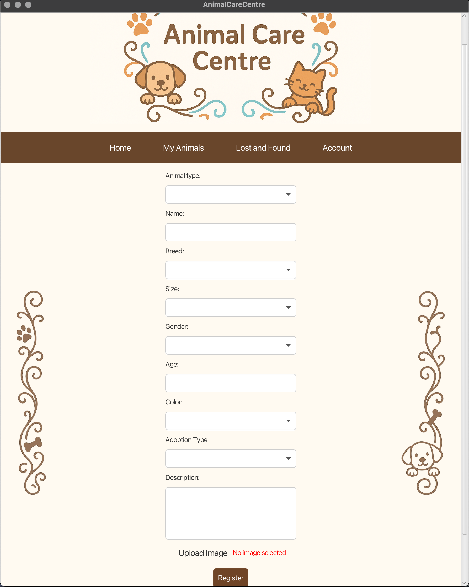
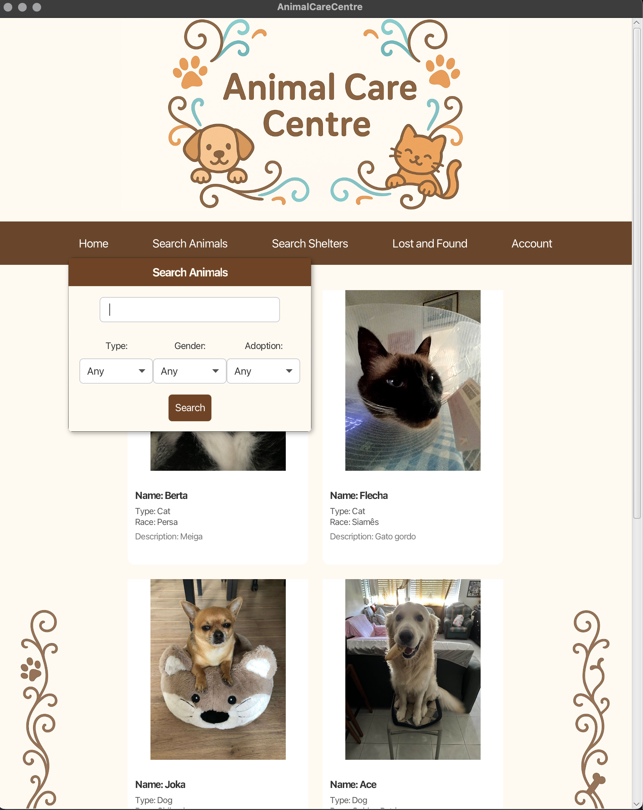
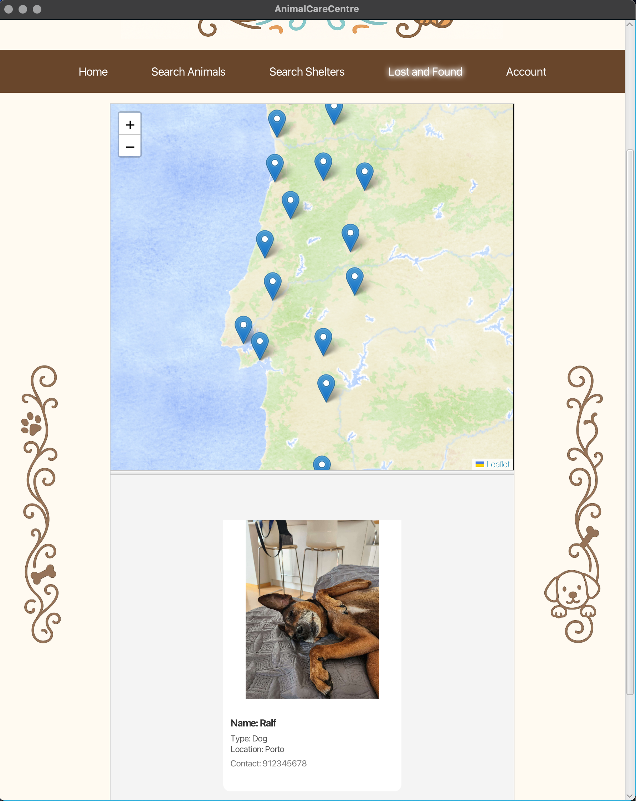

# AnimalCareCentre - README
<p align="center">
  
</p>

University Project: Programming Laboratory | Computer Engineering

## Project Goal
AnimalCareCentre is a comprehensive platform designed to bridge the gap between animal shelters and the community. The platform provides a unified space for shelters to showcase animals in need, while enabling users to easily find, support, and adopt pets. Additionally, it features a dedicated system for reporting and locating lost animals.

The project demonstrates the integration of a Spring Boot backend with a responsive JavaFX frontend, utilizing Hibernate for data management.

## Key Features
### For Shelters
- **Animal Registry:** Register new animals with details, medical history, and photos.
- **Adoption Processing:** Review and approve adoption or foster requests.
- **Management Dashboard:** Comprehensive tools to manage animals, donations, and history.

### For Users
- **Smart Search:** Filter animals by type, gender, size, shelter, and keywords.
- **Adoption & Fostering:** Submit requests directly through the app.
- **Sponsorship:** Donate monthly amounts to sponsor an animal's care.
- **Donation:** One-time donations to shelters.
- **Lost & Found:** Report a lost animal or view reported sightings in the area.

## Screenshots

<table>
  <tr>
    <td></td>
    <td></td>
    <td></td>
  </tr>
  <tr>
    <td align="center"><b>Animal Registration</b></td>
    <td align="center"><b>Smart Search</b></td>
    <td align="center"><b>Lost & Found</b></td>
  </tr>
</table>

## Security
Role-Based Access Control: Secure login for Admins, Shelter Managers, and Standard Users using Spring Security.

## Tech Stack
- Language: Java (JDK 21)
- Framework: Spring Boot
- Frontend: JavaFX
- Database: MySQL / MariaDB
- ORM: Hibernate
- Build Tool: Maven

## Team Members
- [Diogo Ferreira](https://github.com/diogof146)
- [Guilherme Santos](https://github.com/MrGu111)
- [Sara Canelas](https://github.com/saracanelas)
- [Tomás Falcão](https://github.com/Falconz0012)

## Getting Started

This application operates with a split architecture: a **Spring Boot Backend** and a **JavaFX Frontend**. Both need to be running simultaneously.

### Prerequisites
- **Java JDK 21** or higher
- **Maven**
- **MySQL/MariaDB** Database

### Environment Configuration
The **Backend** requires specific environment variables to connect to the database and manage security. You must set these in your IDE (IntelliJ/Eclipse Run Configuration) or terminal session before running the backend.

| Variable | Description |
| :--- | :--- |
| `DB_USERNAME` | Database User |
| `DB_PASSWORD` | Database Password |
| `ADMIN_SECRET` | Admin Secret Key (You choose this) |

> **Note:** The frontend does not require these variables.

### Installation & Running

**1. Clone the repository**
```bash
git clone https://github.com/Animal-Care-UPT/AnimalCareCentre
cd AnimalCareCentre
```

**2. Run the Backend**
*Open a terminal window and execute:*
```bash
mvn spring-boot:run
```
*(Ensure the environment variables above are set in this terminal session or your IDE configuration)*

**3. Run the Frontend**
*Open a **new, separate** terminal window and execute:*
```bash
mvn javafx:run
```

## Special Thanks
Special thanks to **Paula Morais** for her invaluable support throughout the process of development.
